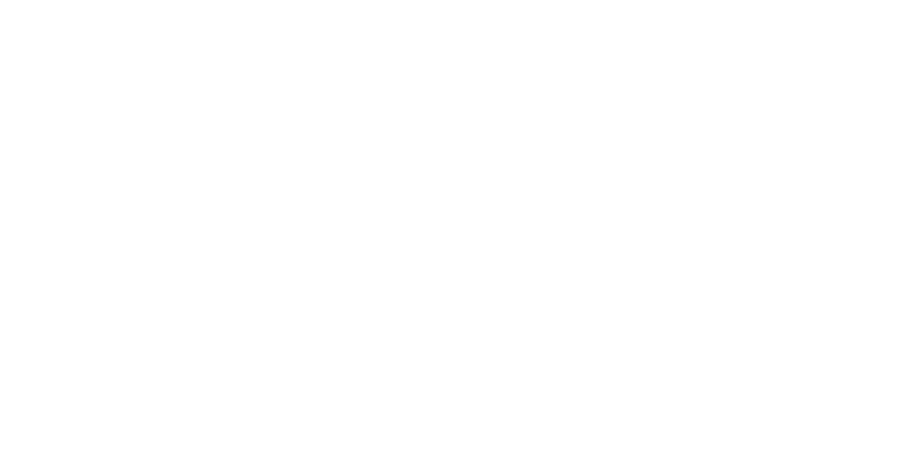

</img>

# Cobalt Engine
This repository contains the source code for the Cobalt Engine Editor, Cobalt Engine SDK, and example projects.
Cobalt Engine is a game engine written in Odin focused on providing a simple scripting system with a powerful editor to build complex scenes. The editor and project are seperate, and while both rely on the SDK, the editor only functions to edit scenes and automate building. Scripting is availible in Odin with a custom-built ECS, and allows users to write code like a regular program that interacts with the SDK as opposed to the engine taking over.

## The Editor
The Cobalt Engine Editor is an interface to create and edit scenes, manage assets, and test projects. It uses the SDK to render the loaded scene, and has access to your project folder so you can import and configure assets and run your game from the editor.

## The SDK
The Cobalt Engine SDK is an Odin package containing all the structs, procedures, and logic needed to make 3D and 2D games. Once a user registers their components and systems, the can create and run an application and automatically load scenes and begin the game loop. It also contains tons of builtin components and systems for things like transforms and rendering.

## Example Projects
This repository also contains some example project folders users can use to start their projects or explore what Cobalt Engine is capable of. These projects should be updated for the most recent version of the engine.
